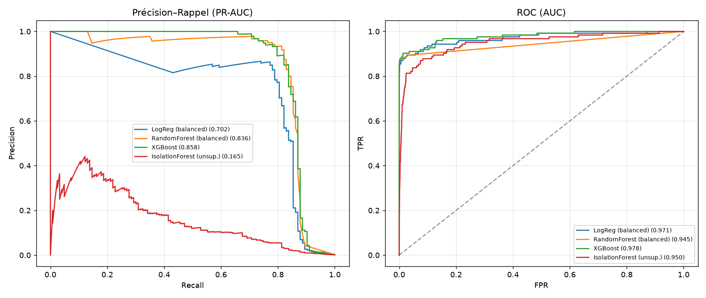
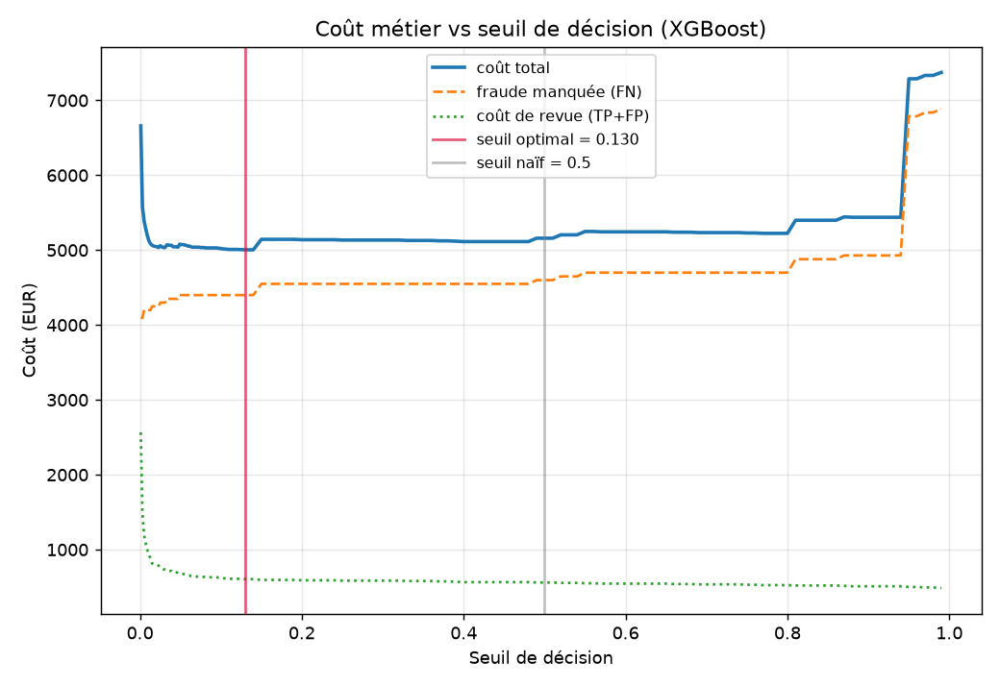

# Détection de fraude sur paiements en ligne

Support de décision pour les **équipes risque** : détecter les transactions
frauduleuses dans un flux où la fraude ne représente que **0,17 %** des
opérations, et choisir le **seuil de blocage** à partir d'un coût métier
explicite — bloquer la fraude **sans pénaliser les clients légitimes**.

---

## 1. Problème métier

Une banque arbitre en permanence entre deux erreurs asymétriques :

- **Fraude manquée (faux négatif)** — la transaction est remboursée : coût
  direct égal au montant, plus les frais de charge-back.
- **Fausse alerte (faux positif)** — un analyste passe en revue la transaction
  et le client peut être bloqué à tort : coût de traitement + friction client.

Un « bon modèle » ne suffit donc pas : il faut décider **où placer le seuil**,
et ce choix est un problème de **coût métier**, pas de statistique. C'est le
fil conducteur du projet.

## 2. Données

- **Source :** ULB *Credit Card Fraud Detection* (Dal Pozzolo et al., 2015) —
  le benchmark public de référence pour la fraude carte.
- **Accès reproductible :** téléchargé depuis **OpenML**
  ([data_id=1597](https://www.openml.org/d/1597)), sans compte requis :
  `python src/data.py` (cache parquet local, ~75 Mo, non versionné).
- **Volume :** **284 807 transactions** réelles (cartes européennes, sept.
  2013), dont **492 fraudes (0,173 %)** — déséquilibre ≈ 1 : 577.
- **Features :** V1–V28 (composantes **PCA anonymisées** par le fournisseur
  pour la confidentialité) + `Amount`. La colonne `Time` du dataset original
  est absente du miroir OpenML.
- **Fallback hors-ligne :** si OpenML est injoignable, `src/data.py` génère un
  substitut synthétique documenté (même schéma, même déséquilibre) pour que le
  pipeline reste exécutable de bout en bout.

## 3. Méthodologie

| Étape | Module | Contenu |
|---|---|---|
| Acquisition | `src/data.py` | Fetch OpenML + cache parquet + fallback synthétique |
| Prétraitement | `src/preprocessing.py` | `log1p(Amount)` standardisé (fit **train uniquement**), split stratifié 75/25 |
| Rééquilibrage | `src/resampling.py` | 5 stratégies comparées à modèle fixe : aucune, `class_weight`, undersampling, SMOTE, SMOTE+Tomek — via pipelines imblearn (resampling appliqué au train seul) |
| Modèles | `src/models.py` | Supervisé : LogReg, Random Forest, **XGBoost** ; non-supervisé : **Isolation Forest** (sans étiquettes) |
| Coût-sensible | `src/cost_sensitive.py` | Balayage du seuil avec coût FN = montant réel de la transaction (min. 50 €) et coût de revue 5 €/alerte |
| Interprétabilité | `src/interpretability.py` | TreeSHAP : beeswarm, importance globale, waterfall d'une alerte |

Évaluation systématiquement adaptée au déséquilibre : **PR-AUC** en métrique de
tête (l'accuracy vaut 99,83 % en ne détectant rien), ROC-AUC, précision /
rappel / F1 et matrices de confusion en complément.

## 4. Résultats clés

### Le rééquilibrage change le seuil, pas le classement

À modèle constant (LogReg), le PR-AUC bouge à peine (0,69–0,72) entre les cinq
stratégies : SMOTE & co ne créent pas d'information. Au seuil fixe 0,5 en
revanche, elles échangent la précision contre le rappel (89 % de fraudes
rappelées mais ~1 700–2 500 fausses alertes). Conclusion opérationnelle : **le
vrai levier est le seuil**, pas le rééchantillonnage.

### Supervisé vs non-supervisé (test, 71 202 transactions)

| Modèle | PR-AUC | ROC-AUC | Précision@0.5 | Rappel@0.5 |
|---|---|---|---|---|
| **XGBoost** (`scale_pos_weight`) | **0,858** | 0,978 | 0,893 | 0,813 |
| Random Forest (balanced) | 0,836 | 0,945 | 0,967 | 0,724 |
| LogReg (balanced) | 0,702 | 0,971 | 0,060 | 0,886 |
| Isolation Forest (non-sup.) | 0,165 | 0,950 | 0,276 | 0,276 |

L'Isolation Forest, entraîné **sans aucune étiquette**, atteint un ROC-AUC de
0,95 : trop imprécis pour décider seul, mais pertinent comme filet de sécurité
contre les schémas de fraude *nouveaux*, absents de l'historique labellisé.

### Seuil coût-sensible (XGBoost)

| Scénario | Coût total (test) |
|---|---|
| Aucun modèle (toute la fraude passe) | ≈ 16 600 € |
| Modèle, seuil naïf 0,5 | ≈ 5 160 € (−69 %) |
| Modèle, **seuil optimal ≈ 0,13** | ≈ 5 000 € (−70 %) |

La courbe de coût est plate autour de l'optimum : le choix du seuil est
**robuste**, et le cadre permet de rejouer l'analyse avec les vrais coûts d'une
équipe risque.

### Interprétabilité

Quatre composantes concentrent le signal (V14, V4, V12, V10) ; le waterfall
SHAP fournit la vue « pourquoi cette alerte ? » indispensable à l'audit d'une
décision de blocage.

| | |
|---|---|
|  |  |

## 5. Limites

- **Deux jours de données, une seule banque** : aucune garantie de
  généralisation temporelle/géographique ; en production, la dérive des schémas
  de fraude impose un réentraînement continu.
- **Features PCA anonymisées** : l'interprétation SHAP reste structurelle
  (« V14 bas → suspect ») ; sur données brutes on lirait commerçant, pays,
  heure…
- **Coûts illustratifs** (5 €/revue, plancher 50 €) — à recalibrer avec les
  chiffres réels du métier.
- **Split aléatoire stratifié** : un split strictement temporel (train passé /
  test futur) serait plus réaliste et plus difficile.

## 6. Reproduction

```bash
# 1. Environnement
conda create -n fraud python=3.11 -y && conda activate fraud
pip install -r requirements.txt

# 2. Pipeline complet (chaque script est autonome)
python src/data.py              # télécharge + cache le dataset (~2 min)
python src/resampling.py        # comparaison des rééquilibrages
python src/models.py            # supervisé vs non-supervisé
python src/cost_sensitive.py    # balayage de seuil coût métier
python src/interpretability.py  # figures SHAP

# 3. Notebook de synthèse (rebuild + exécution)
python notebooks/build_notebook.py
```

Toutes les sorties (CSV de métriques, figures PNG) sont régénérées dans
`reports/`. `random_state=42` partout.

## 7. Structure du repo

```
02-online-payment-fraud/
├── data/                # cache parquet local (non versionné)
├── notebooks/
│   ├── 02_fraud_detection.ipynb   # notebook exécuté — le récit du projet
│   └── build_notebook.py          # build reproductible du notebook
├── src/
│   ├── data.py                    # acquisition OpenML + fallback
│   ├── preprocessing.py           # features + split + scaling sans fuite
│   ├── evaluation.py              # métriques adaptées au déséquilibre
│   ├── resampling.py              # 5 stratégies de rééquilibrage
│   ├── models.py                  # LogReg / RF / XGBoost / IsolationForest
│   ├── cost_sensitive.py          # seuil optimal par coût métier
│   └── interpretability.py        # SHAP
├── reports/
│   ├── figures/                   # 7 visuels exportés
│   └── *.csv                      # tables de métriques
├── README.md
└── requirements.txt
```

---

## Résumé CV (2-3 lignes)

> **Détection de fraude sur paiements en ligne** — Python, scikit-learn,
> XGBoost, SHAP. Pipeline complet sur 285 k transactions réelles (0,17 % de
> fraudes) : comparaison contrôlée de stratégies de rééquilibrage
> (SMOTE, pondération), supervisé vs détection d'anomalies non supervisée,
> et optimisation **coût-sensible** du seuil de décision (PR-AUC 0,86, coût de
> fraude −70 %), avec explications SHAP par alerte.
